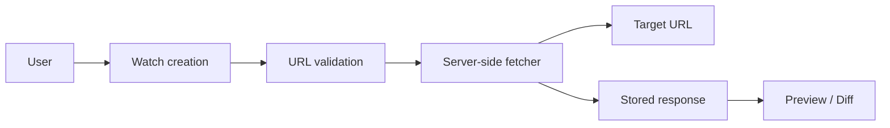
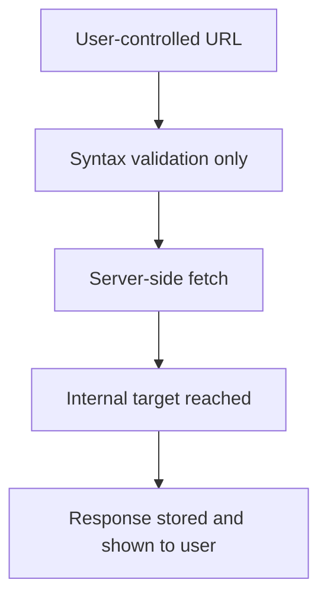
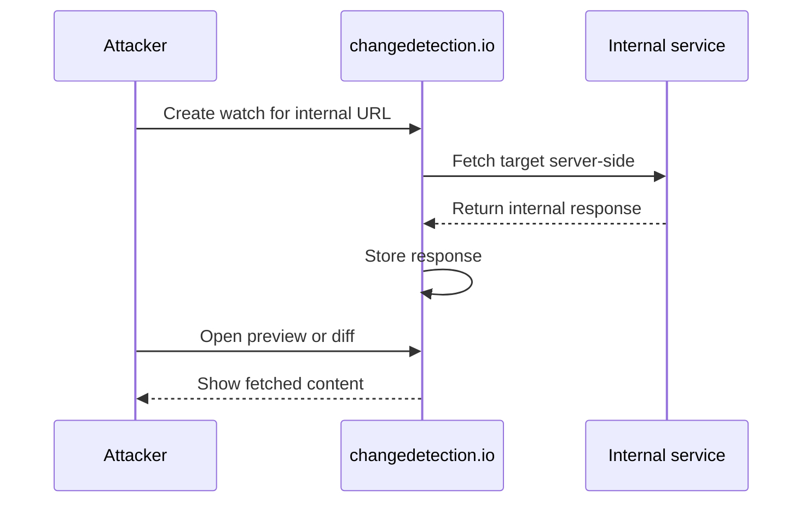

# CVE-2026-27696: Server-Side Request Forgery (SSRF) via Watch URLs

| | |
|---|---|
| **CVE ID** | CVE-2026-27696 |
| **Severity** | 🔴 High |
| **CVSS Score** | 8.6 |
| **CVSS Vector** | CVSS:3.1/AV:N/AC:L/PR:N/UI:N/S:C/C:H/I:N/A:N |
| **CWE** | CWE-918: Server-Side Request Forgery (SSRF) |
| **Affected Product** | changedetection.io \< 0.54.1 |
| **Patched Version** | 0.54.1 |

## Summary

changedetection.io is built to fetch remote content on a schedule and show users what changed. That feature becomes dangerous when the application accepts watch URLs that resolve to internal or privileged destinations.

The application validated URL format and allowed schemes, but it did not block private, loopback, or link-local IP targets. As a result, a user who could add a "watch" could make the server request internal resources such as `127.0.0.1`, RFC1918 addresses, or cloud metadata endpoints like `169.254.169.254`.

The fetched response was stored and exposed back through the UI, which turned the watch feature into a practical internal data access primitive.

## Product / Feature Context

A `watch` in changedetection.io is a user-defined URL that the server fetches periodically. The intended workflow is simple:

1. A user submits a URL.
2. The server fetches it.
3. The content is stored.
4. The UI shows a preview or diff over time.

That means watch creation is also a trust decision. Once a URL is accepted, the request comes from the server's network context, not the user's browser.



## Vulnerability Overview

The bug was an SSRF caused by incomplete URL safety checks.

A watch URL could point to an internal destination, and changedetection.io would still fetch it. That broke the expected boundary between a low-privileged user input field and server-side network reachability.

Examples of dangerous but accepted targets included:

```text
http://127.0.0.1/
http://10.0.0.1/
http://169.254.169.254/
```

If the application server could reach those destinations, changedetection.io would request them and store the response.

## Root Cause Analysis

The core issue was that URL validation focused on syntax instead of destination.

The validation logic allowed a URL as long as it used an approved scheme and passed the generic URL validator:

```python
@lru_cache(maxsize=1000)
def is_safe_valid_url(test_url):

    safe_protocol_regex = '^(http|https|ftp):'

    # Check protocol
    pattern = re.compile(os.getenv('SAFE_PROTOCOL_REGEX', safe_protocol_regex), re.IGNORECASE)
    if not pattern.match(test_url.strip()):
        return False

    # Check URL format
    if not validators.url(test_url, simple_host=True):
        return False

    return True  # No IP address validation performed
```

That is the failure point. A well-formed URL is not necessarily a safe URL.

Once the URL passed validation, the request path used it directly:

```python
r = session.request(method=request_method,
                    url=url,
                    headers=request_headers,
                    timeout=timeout,
                    proxies=proxies,
                    verify=False)
```

The fetched response was then stored and made viewable through the application:

```python
self.content = r.text
self.raw_content = r.content
```

This is the key trust boundary failure:



## Attack Path / Exploitation Walkthrough

A realistic attack path was short:

1. The attacker gained access to changedetection.io and created a watch.
2. Instead of using a public site, they supplied an internal URL.
3. The application accepted the URL because it looked valid.
4. The server fetched the target from its own network context.
5. The response was stored and shown in the preview or diff view.



This made the issue especially useful against:

- localhost-only services
- internal web apps and APIs
- cloud metadata endpoints
- services reachable only from the container or host network

## Impact Analysis

The direct impact was internal data exposure through server-side requests.

Depending on the environment, an attacker could use this to access:

- localhost services
- internal RFC1918 resources
- cloud metadata endpoints
- internal APIs and administrative interfaces

In cloud deployments, metadata access could expose temporary credentials or identity tokens. In other environments, the issue could expose internal dashboards, API responses, or other sensitive services bound to private interfaces.

The fact that responses were stored and displayed made the vulnerability much more practical than a blind SSRF.

## Remediation Discussion

The correct fix is to validate the resolved destination, not just the URL string.

At a minimum, the application should:

- resolve the hostname before allowing the request
- reject loopback, private, and link-local IPs by default
- fail closed when resolution is ambiguous
- apply the same checks across every watch-creation path

A straightforward implementation looks like this:

```python
import ipaddress
import socket

BLOCKED_NETWORKS = [
    ipaddress.ip_network('127.0.0.0/8'),     # Loopback
    ipaddress.ip_network('10.0.0.0/8'),      # Private (RFC 1918)
    ipaddress.ip_network('172.16.0.0/12'),   # Private (RFC 1918)
    ipaddress.ip_network('192.168.0.0/16'),  # Private (RFC 1918)
    ipaddress.ip_network('169.254.0.0/16'),  # Link-local / Cloud metadata
    ipaddress.ip_network('::1/128'),         # IPv6 loopback
    ipaddress.ip_network('fc00::/7'),        # IPv6 unique local
    ipaddress.ip_network('fe80::/10'),       # IPv6 link-local
]

def is_private_ip(hostname):
    try:
        for info in socket.getaddrinfo(hostname, None):
            ip = ipaddress.ip_address(info[4][0])
            for network in BLOCKED_NETWORKS:
                if ip in network:
                    return True
    except socket.gaierror:
        return True
    return False
```

Then the URL validator can reject unsafe destinations before returning success:

```python
parsed = urlparse(test_url)
if parsed.hostname and is_private_ip(parsed.hostname):
    logger.warning(f"URL '{test_url}' resolves to a private/reserved IP address")
    return False
```

For deployments that intentionally monitor internal services, an explicit opt-in override is much safer than allowing private targets by default.

## Key Takeaways

This bug is a good example of why SSRF defenses cannot stop at URL format checks.

The real security question is not whether a URL looks valid. It is whether the server should be allowed to go there.

Any feature that lets users trigger server-side requests should treat destination validation as a core security control. Otherwise, a normal application feature can become a clean bridge into internal network space.

## Disclosure Timeline

| Date | Event |
|---|---|
| 2026-02-16 | Initial Report via GitHub Private Vulnerability Report |
| 2026-02-22 | Maintainer Acknowledges |
| 2026-02-23 | GitHub Staff Assigns CVE-2026-27696 |
| 2026-02-23 | Patch Released ([0.54.1](https://github.com/dgtlmoon/changedetection.io/releases/tag/0.54.1)) |
| 2026-02-23 | Maintainer Releases ([GHSA-3c45-4pj5-ch7m](https://github.com/dgtlmoon/changedetection.io/security/advisories/GHSA-3c45-4pj5-ch7m "GHSA-3c45-4pj5-ch7m")) |
| 2026-02-25 | Published to [GitHub Advisory Database](https://github.com/advisories/GHSA-3c45-4pj5-ch7m) |
| 2026-02-26 | Published to [National Vulnerability Database](https://nvd.nist.gov/vuln/detail/CVE-2026-27696) |

